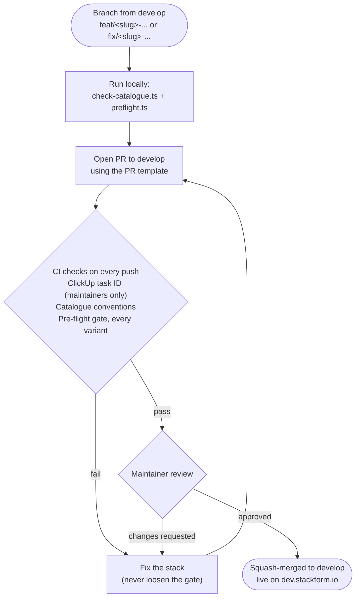
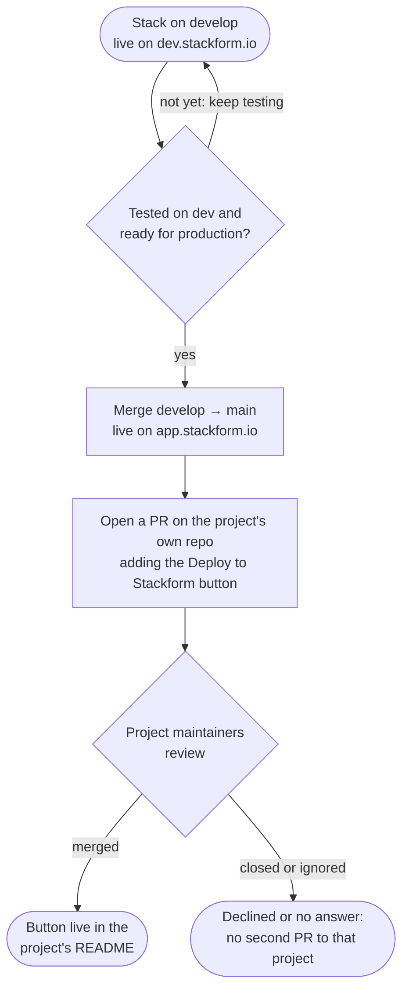

# Contributing

Thanks for helping grow the catalogue. This page covers how to open a pull
request and what a stack must meet before it is merged.

## The contributor flow



Your part ends when the PR is merged into `develop`. From there, Stackform
maintainers take the stack to production and to the project's own repository
(see [From `develop` to production](#from-develop-to-production)).

## Branches

| Branch    | Purpose                                                                                                                                                           |
| --------- | ----------------------------------------------------------------------------------------------------------------------------------------------------------------- |
| `develop` | Integration branch, deployed to `dev.stackform.io`. **All PRs target `develop`.**                                                                                 |
| `main`    | Released stacks, deployed to `app.stackform.io`. Only maintainers merge into it, from `develop`. See [From `develop` to production](#from-develop-to-production). |

Name your branch after the change and the stack it touches:

```
feat/<slug>-<short-description>     # new stack or new option, e.g. feat/n8n-stack
fix/<slug>-<short-description>      # bug fix, e.g. fix/umami-ssl-mode
chore/<short-description>           # repo-wide tooling or docs
```

## Pull request rules

1. **One stack per PR.** Repo-wide changes (tooling, templates, docs) go in
   their own PR.
2. **Title in [Conventional Commits](https://www.conventionalcommits.org/)
   form, scoped to the slug:** `feat(umami): add SMTP settings`,
   `fix(sentry): pin postgres major version`, `docs: explain x-showWhen`.
   Maintainers also add the ClickUp task ID, as in `feat(umami): add SMTP settings (SF-512)`.
   CI checks that the task exists. PRs from forks and PRs labelled
   `skip-clickup` are exempt.
3. **Fill in the PR template.** A blank template will not be reviewed. Pick the
   template that matches the change:
   - Changing an existing stack: the default template opens automatically.
   - Adding a new stack: add `?template=new-stack.md` to the compare URL, e.g.
     `https://github.com/stackform-io/stackform-stacks/compare/develop...my-branch?template=new-stack.md`.
4. **Pass the checks.** The **Pre-flight Gate** check must be green. It
   synthesises every variant in the app's `preflight.json` and grades the
   templates with the platform's pre-flight gate (see [Checks](README.md#checks)).
   Fix the stack; don't loosen the gate. The checks run from the base
   branch, so editing `gate/` or `scripts/` in the same PR does not change how
   it is graded.
5. **Show that it deploys.** For anything that changes resources, include
   proof of a real deploy: stack outputs, a screenshot of the running app.
6. **Call out anything destructive.** When a change replaces a database,
   volume or other stateful resource, or renames or removes a `configSchema`
   property, say so in the PR. It will need a major version bump.
7. **Merging.** PRs are squash-merged after a maintainer approves them.

## From `develop` to production

When your PR is merged into `develop`, your part is done. The rest is up to
the maintainers:



1. **Dev.** The stack goes live on `dev.stackform.io`, where maintainers keep
   testing it.
2. **Production.** When the maintainers decide a stack is ready, they merge
   it from `develop` into `main` and it goes live on `app.stackform.io`.
3. **Upstream PR.** For each stack that ships to production, a maintainer
   opens a PR on the **project's own repository** (for example
   `umami-software/umami`). The PR proposes adding the **Deploy to
   Stackform** button to the project's README, so the project's own
   maintainers can review and approve the stack. The button points at
   production, and uses the medium size unless the project's README calls
   for another (see [Deploy button](README.md#deploy-button)):

   ```markdown
   [](https://app.stackform.io/start/deploy?template=<slug>)
   ```

Stackform maintainers open the upstream PR, not necessarily the person who
contributed the stack. **Please don't open one yourself.** A button that
points at a stack not yet in production would be broken, and one voice
towards each upstream project keeps things clear for its maintainers. The
upstream PR links back to the stack in this repository, and credits you as
its author.

If the project's maintainers close the PR or never answer it, we don't open
a second one to that project.

## Versioning

`version` in the app's `package.json` is the version Stackform publishes.
Bump it with `npm version` from inside the app directory:

| Change                                                                                            | Bump    |
| ------------------------------------------------------------------------------------------------- | ------- |
| Fix with no change to the form or resources                                                       | `patch` |
| New optional form field, new feature, upstream image bump                                         | `minor` |
| Renamed or removed field, replaced stateful resource, new default that changes an existing deploy | `major` |

## Accepting a new project

We add a project when:

- It is open source under an OSI-approved license that allows self-hosting.
- It publishes an official container image or release artefact that we can
  pin to a version.
- It is actively maintained (releases or commits in the last six months).
- It does not duplicate a stack we already have, unless it is clearly
  different (another tier, another database).

Open an issue first if you are unsure. It saves you building a stack we
cannot take.

## What every stack must have

### Files

Follow the layout in the [README](README.md#app-layout): `tool.json`,
`preflight.json`, `README.md`, `bin/<slug>.ts`, `bin/prm-attribution.ts`, `lib/`,
`cdk.json`, `package.json`, `package-lock.json` and `tsconfig.json`.
Copy an existing stack such as [`apps/umami`](apps/umami) as a starting point.

### `tool.json`

All required fields filled in, as described in
[The stack definition](README.md#the-stack-definition-tooljson). In
particular:

- `slug` matches the directory name and is unique.
- Every `configSchema` property has a `title` and a `description`. Every
  property except optional strings (a custom domain, an SSH key name) has a
  `default`. Numbers are bounded by `enum` or `minimum`/`maximum`.
- `estimatedCost` is itemised at the default settings in `us-east-1`.
- Stateful stacks expose `destroyDataOnDelete`, defaulting to `false`.

### Entry point (`bin/<slug>.ts`)

- Calls `applyPrmAttribution(app)` straight after creating the app.
- Reads `toolConfig` from context and validates every value, with a clear
  error message, before creating the stack.
- Synthesises with no context at all (all defaults).

### `preflight.json`

- A variant for every deploy-form choice that changes the resources or IAM,
  such as a custom domain, a tier or an opt-in integration. See
  [Checks](README.md#checks).
- `node scripts/preflight.ts apps/<slug>` and `npm run lint` pass locally.

### Architecture and security

- Only the load balancer (or equivalent entry point) is reachable from the
  internet. Compute sits in private subnets, and databases in isolated subnets.
- Secrets are generated in Secrets Manager and injected at runtime. No
  passwords, keys or tokens in code, context or plain environment variables.
- Storage and databases are encrypted at rest.
- The upstream image is pinned to an exact version, never `latest`, in one
  named constant (e.g. `UMAMI_VERSION`).
- HTTPS through ACM whenever `domainName` and `hostedZoneId` are set.
- Databases keep a final snapshot on delete unless `destroyDataOnDelete` is on.
- The stack deletes cleanly, with no orphaned resources left behind except
  the snapshots the user asked to keep.
- The stack exposes an `AppUrl` output.

### `README.md`

Use these sections, in this order: **Architecture**, **Configuration**,
**Post-Deploy** (first login, default credentials to change), **Deleting**,
**Cost**, and **Upgrading <Project>**. Name the upstream license in the
intro.

### Catalogue

- Add a row to the [stacks table](README.md#stacks), in alphabetical order,
  with its deploy button.
- Open a PR in the platform repository adding the logo at
  `web/public/images/apps/<slug>.svg`, and link it from this PR.

## License

This repository is licensed under the [GNU AGPL v3.0](LICENSE). By opening
a pull request you agree that your contribution is licensed under the same
terms.
