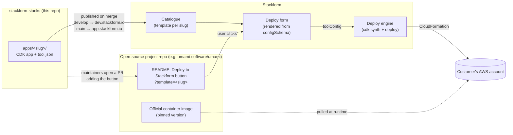
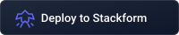

# Stackform Stacks

CDK stacks maintained by Stackform for deploying open-source projects to AWS
with the **Deploy to Stackform** button.

Each directory under `apps/` is a self-contained CDK app for one project.

## How it works

The stacks live here, not in the projects' own repositories. An upstream
project gets a one-line README change: the button, pointing at its stack's
slug. When AWS or the project changes, we fix the stack here once, and every
button keeps working.



1. **A stack is written here.** It holds the CDK app that decomposes the
   project onto managed AWS services, plus `tool.json`, which describes the
   project for the catalogue and defines the deploy form.
2. **Stackform publishes it.** Merges to `develop` reach `dev.stackform.io`,
   and merges to `main` reach `app.stackform.io`.
3. **The upstream project gets the button.** Once a stack is in production,
   Stackform maintainers open a PR on the project's repository adding the
   button to its README (see
   [From `develop` to production](CONTRIBUTING.md#from-develop-to-production)).
4. **A user clicks it.** Stackform opens the deploy form for that slug. The
   user's choices reach the CDK app as `toolConfig`, and the deploy engine
   deploys the stack into the user's own AWS account. The stack pulls the
   project's official image; nothing is rebuilt or forked.

## Stacks

> The buttons point at the **dev** deployment (`dev.stackform.io`), which
> tracks the `develop` branch.

| Stack                           | Project                         | Category              | Est. cost / mo | Deploy                                                                                                                            |
| ------------------------------- | ------------------------------- | --------------------- | -------------- | --------------------------------------------------------------------------------------------------------------------------------- |
| [Flagsmith](apps/flagsmith)     | Feature flags and remote config | Developer Tools       | ~$110          | [](https://dev.stackform.io/start/deploy?template=flagsmith)   |
| [LiteLLM Proxy](apps/litellm)   | LLM gateway                     | AI & Machine Learning | ~$105 + usage  | [](https://dev.stackform.io/start/deploy?template=litellm)     |
| [Prefect](apps/prefect)         | Workflow orchestration          | Data Engineering      | ~$117          | [](https://dev.stackform.io/start/deploy?template=prefect)     |
| [Sentry](apps/sentry)           | Error tracking                  | Monitoring            | ~$45–300       | [](https://dev.stackform.io/start/deploy?template=sentry)      |
| [Umami](apps/umami)             | Privacy-focused web analytics   | Analytics             | ~$96           | [](https://dev.stackform.io/start/deploy?template=umami)       |
| [Uptime Kuma](apps/uptime-kuma) | Uptime monitoring               | Monitoring            | ~$97           | [](https://dev.stackform.io/start/deploy?template=uptime-kuma) |

Costs are `us-east-1` estimates at the default settings; each stack's README
breaks them down.

## Deploy button

The button comes in four variants. Every variant links to the same place,
`/start/deploy?template=<slug>`; only the image changes.

| Variant | Use it for                                         | Image                                                                         | Preview                                                             |
| ------- | -------------------------------------------------- | ----------------------------------------------------------------------------- | ------------------------------------------------------------------- |
| Small   | Icon only, for tables and badge rows (as above)    | [`deploy-to-stackform-icon.svg`](assets/buttons/deploy-to-stackform-icon.svg) |  |
| Medium  | The default, in a README's install section         | [`deploy-to-stackform.svg`](assets/buttons/deploy-to-stackform.svg)           |       |
| Large   | A hero spot at the top of a README or landing page | [`deploy-to-stackform-lg.svg`](assets/buttons/deploy-to-stackform-lg.svg)     |    |
| Accent  | Medium size in the accent colour, for dark pages   | [`deploy-to-stackform-dark.svg`](assets/buttons/deploy-to-stackform-dark.svg) |  |

The images live in [`assets/buttons/`](assets/buttons). Inside this
repository, reference them by relative path, as the table above does;
anywhere else, use the raw URL from `main`:

<!-- prettier-ignore -->
```markdown
<!-- Small -->
[](https://app.stackform.io/start/deploy?template=<slug>)

<!-- Medium -->
[](https://app.stackform.io/start/deploy?template=<slug>)

<!-- Large -->
[](https://app.stackform.io/start/deploy?template=<slug>)

<!-- Accent -->
[](https://app.stackform.io/start/deploy?template=<slug>)
```

Use `app.stackform.io` in a project's README, and `dev.stackform.io` only
for testing, as in the table above. Keep the alt text `Deploy to Stackform`,
so the link still reads correctly where images are blocked.

## App layout

```
apps/<slug>/
  bin/<slug>.ts            # CDK entry point: reads and validates toolConfig
  bin/prm-attribution.ts   # AWS Partner Revenue Measurement tagging
  lib/                     # Stack definitions
  tool.json                # Stack definition: catalogue metadata and deploy form
  preflight.json           # Deploy-form variants the pre-flight gate synthesises
  README.md                # Architecture, configuration, post-deploy, cost
  cdk.json
  package.json             # Version, and aws-cdk-lib pinned to a version the deploy engine can read
  package-lock.json
  tsconfig.json
```

## The stack definition (`tool.json`)

`tool.json` is what Stackform reads to list the stack in the catalogue and
render its deploy form. When someone deploys, the values from the form reach
the CDK app as the `toolConfig` context value.

| Field               | Required | Description                                                                                                                                                         |
| ------------------- | -------- | ------------------------------------------------------------------------------------------------------------------------------------------------------------------- |
| `slug`              | yes      | Unique ID, and the same as the directory name. The button uses it in `?template=<slug>`. Never rename it once published: that breaks every button that links to it. |
| `name`              | yes      | Display name, e.g. `"Umami (Self-Hosted)"`.                                                                                                                         |
| `description`       | yes      | One or two sentences: what the project is, how it runs on AWS, and the rough monthly cost.                                                                          |
| `cdkEntryPoint`     | yes      | Path to the entry point, e.g. `bin/umami.ts`.                                                                                                                       |
| `configSchema`      | yes      | JSON Schema (`type: "object"`) for the deploy form. See below.                                                                                                      |
| `visibility`        | yes      | `PUBLIC`, `ORGANIZATION` or `PRIVATE`. Stacks in this repo are `PUBLIC`.                                                                                            |
| `category`          | yes      | Catalogue group. Reuse an existing one when it fits: `Analytics`, `AI & Machine Learning`, `Data Engineering`, `Developer Tools`, `Monitoring`.                     |
| `tags`              | yes      | Lowercase, kebab-case search terms. Include the slug and `self-hosted`.                                                                                             |
| `estimatedCost`     | yes      | `{ "monthly": <number USD>, "description": "~$N/mo: itemised breakdown" }` at the default settings.                                                                 |
| `estimatedDuration` | yes      | How long a first deploy takes, e.g. `"15-25 minutes"`.                                                                                                              |
| `logoUrl`           | yes      | `/images/apps/<slug>.svg` (or `.png`). The image itself lives in the platform repo's `web/public/images/apps/`.                                                     |
| `defaultParams`     | no       | Values the form is pre-filled with.                                                                                                                                 |
| `tiers`             | no       | Deployment tiers (e.g. `["STARTER", "OPTIMIZED"]`) for stacks that offer more than one architecture.                                                                |
| `iconSlug`          | no       | AWS architecture icon name, used by platform tools rather than marketplace apps.                                                                                    |

The version shown in Stackform comes from `version` in `package.json`, not from
`tool.json`.

### `configSchema`

Each property becomes a field on the deploy form:

- `type` (`string`, `number` or `boolean`), `title` and `description` are required.
  Write the description for someone who does not know AWS well, and state
  the cost impact when there is one ("Doubles the database cost.").
- Use `enum`, or `minimum`/`maximum`, to bound every value, and give every
  property a `default` that deploys successfully.
- `x-showWhen` shows a field only when another field has a given value:
  `{ "tier": "starter" }` means an exact match, and `{ "domainName": "*" }`
  means any non-empty value.
- Only list a property under `required` when there is no safe default.

The entry point must validate every value itself, because `toolConfig` can
arrive without passing through the form. Values may arrive as strings, so
coerce them (`Number(...)`, `value === true || value === "true"`) and throw a
clear error when a value is out of range, so that the synth fails instead of
the CloudFormation deploy.

## Working on an app

```bash
cd apps/umami
npm ci
npx aws-cdk synth
```

To try other form values, put them under `context.toolConfig` in `cdk.json`,
which is where the deploy engine writes them. Don't commit that change. Don't
use `-c toolConfig='{...}'` either: the CDK CLI passes `-c` values as strings,
so the stack silently synthesises its defaults.

## Checks

Every PR runs these checks, and **Pre-flight Gate** must pass before merging:

- **Catalogue conventions** (`node scripts/check-catalogue.mjs`): each app has
  the required files, a valid `tool.json`, and a row in the stacks table.
- **Pre-flight** (`node scripts/preflight.mjs apps/<slug>`): the app
  type-checks, and every variant in its `preflight.json` synthesises and passes
  the [SF-441](https://app.clickup.com/t/86cbaxm8e) pre-flight gate. The
  default settings always run as one variant. The gate checks for an `AppUrl`
  output, no public databases or tasks, encryption, no plaintext secrets, and
  IAM wildcards. The gate itself lives in `stackform-cdk`; to run it locally,
  check that repository out next to this one, or point `STACKFORM_CDK_DIR` at
  it.
- **ClickUp task ID** (maintainers' PRs only): the title contains an `SF-<id>`
  that exists.

`preflight.json` lists the deploy-form choices that change the template, by
name:

```json
{
  "variants": {
    "https": {
      "domainName": "analytics.example.com",
      "hostedZoneId": "Z123456"
    }
  }
}
```

Add a variant for every option that changes the resources or IAM: a custom
domain, another tier, an opt-in integration. Grading only the defaults grades
one template out of several.

## Contributing

PRs go to `develop`. Read [CONTRIBUTING.md](CONTRIBUTING.md) before you open
one: it lists what a new stack must include and how changes are reviewed.
When a stack reaches production, Stackform maintainers open a PR on the
project's own repository proposing the Deploy to Stackform button, so the
project's own maintainers can approve it.

## License

[GNU Affero General Public License v3.0](LICENSE). This covers the CDK code
and metadata in this repository only. Each deployed project keeps its own
upstream license; the stacks deploy the projects' official releases.
